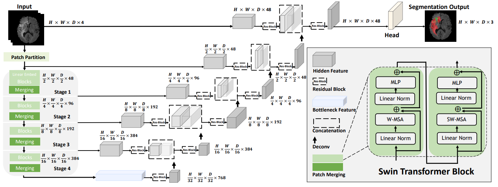

# Model Overview
This repository contains the code for [Swin UNETR for the task of brain tumor  segmentation using the [BraTS 21, ASNR 2023, BRATS SSA 2024]. Swin UNETR ranked among top-perfoming models in BraTS 21 validation phase. The architecture of Swin UNETR is demonstrated as below


# Tutorial
Our tutorial for BraTS21 brain tumor segmentation using Swin UNETR model is provided in the following link.

[]([SWIN UNETR 2024.ipynb](https://colab.research.google.com/drive/1s19-dIDgSxXp5tcKZjDfOJbaVo_JH1Ao?usp=sharing))

# Installing Dependencies
Dependencies can be installed using:
``` bash
pip install -r requirements.txt
```

# Data Description

Modality: MRI
Size: 1345 3D volumes (1311 Training + 34 Validation)
Challenge: BRATS SSA Brain Tumor Segmentation Challenge


The provided segmentation labels have values of 1 for NCR, 2 for ED, 3 for ET, and 0 for everything else.

# Label.py was used to change ET label "4" to "3" in 2021 training sets.

# create.py generates json file for training sets.

# Training

A Swin UNETR network with standard hyper-parameters for brain tumor semantic segmentation (BraTS dataset) is be defined as:

``` bash
model = SwinUNETR(img_size=(128,128,128),
                  in_channels=4,
                  out_channels=3,
                  feature_size=48,
                  use_checkpoint=True,
                  )
```


The above Swin UNETR model is used for multi-modal MR images (4-channel input) with input image size ```(128, 128, 128)``` and for ```3``` class segmentation outputs and feature size of  ```48```.
More details can be found in [1]. In addition, ```use_checkpoint=True``` enables the use of gradient checkpointing for memory-efficient training.

Using the default values for hyper-parameters, the following command can be used to initiate training using PyTorch native AMP package:
``` bash
python main.py
--feature_size=48
--batch_size=1
--logdir=unetr_test_dir
--fold=0
--optim_lr=1e-4
--lrschedule=warmup_cosine
--infer_overlap=0.5
--save_checkpoint
--val_every=10
--json_list=<jsonlist>
--data_dir=<datadir>
--use_checkpoint
--noamp
```


## NOTE: "main.py" contains codes with Dice Loss function, "maincrossentropy.py" contains codes with Dice Cross Entropy Loss Functions. Interchange "main.py" for "maincrossentropy.py when training or finetuning with Dice Cross Entropy Loss"


## Training from scratch on single GPU with gradient check-pointing and without AMP

To train a `Swin UNETR` from scratch on a single GPU with gradient check-pointing and without AMP:

```bash
python main.py --json_list=<json-path> --data_dir=<data-path> --val_every=5 --noamp \
--roi_x=128 --roi_y=128 --roi_z=128  --in_channels=4 --spatial_dims=3 --use_checkpoint --feature_size=48
```

## Training from scratch on multi-GPU with gradient check-pointing and without AMP

To train a `Swin UNETR` from scratch on multi-GPU for 300 epochs with gradient check-pointing and without AMP:

```bash
python main.py --json_list=<json-path> --data_dir=<data-path> --max_epochs=300 --val_every=5 --noamp --distributed \
--roi_x=128 --roi_y=128 --roi_z=128  --in_channels=4 --spatial_dims=3 --use_checkpoint --feature_size=48
```

## Training from scratch on multi-GPU without gradient check-pointing

To train a `Swin UNETR` from scratch on multi-GPU without gradient check-pointing:

```bash
python main.py --json_list=<json-path> --data_dir=<data-path> --val_every=5 --distributed \
--roi_x=128 --roi_y=128 --roi_z=128  --in_channels=4 --spatial_dims=3 --feature_size=48
```

# Evaluation

To evaluate a `Swin UNETR` on a single GPU, the model path using `pretrained_dir` and model
name using `--pretrained_model_name` need to be provided:

```bash
python test.py --json_list=<json-path> --data_dir=<data-path> --feature_size=<feature-size>\
--infer_overlap=0.6 --pretrained_model_name=<model-name> --pretrained_dir=<model-dir>
```

# Finetuning

Please download the checkpoints for models presented in the above table and place the model checkpoints in `pretrained_models` folder.
Use the following commands for finetuning.

## Finetuning on single GPU with gradient check-pointing and without AMP

To finetune a `Swin UNETR`  model on a single GPU on fold 1 with gradient check-pointing and without amp,
the model path using `pretrained_dir` and model  name using `--pretrained_model_name` need to be provided:

```bash
python main.py --json_list=<json-path> --data_dir=<data-path> --val_every=5 --noamp --pretrained_model_name=<model-name> \
--pretrained_dir=<model-dir> --fold=1 --roi_x=128 --roi_y=128 --roi_z=128  --in_channels=4 --spatial_dims=3 --use_checkpoint --feature_size=48
```

## Finetuning on multi-GPU with gradient check-pointing and without AMP

To finetune a `Swin UNETR` base model on multi-GPU on fold 1 with gradient check-pointing and without amp,
the model path using `pretrained_dir` and model  name using `--pretrained_model_name` need to be provided:

```bash
python main.py --json_list=<json-path> --distributed --data_dir=<data-path> --val_every=5 --noamp --pretrained_model_name=<model-name> \
--pretrained_dir=<model-dir> --fold=1 --roi_x=128 --roi_y=128 --roi_z=128  --in_channels=4 --spatial_dims=3 --use_checkpoint --feature_size=48
```

# Segmentation Output

By following the commands for evaluating `Swin UNETR` in the above, `test.py` saves the segmentation outputs
in the original spacing in a new folder based on the name of the experiment which is passed by `--exp_name`.
